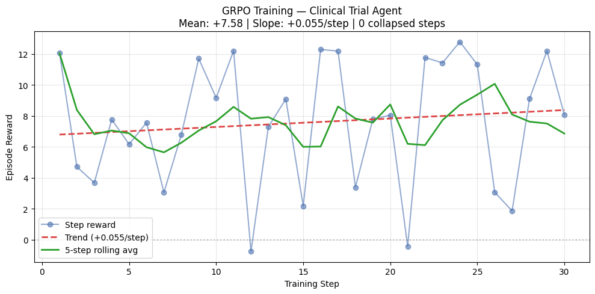

# OpenEnv Clinical Trial — RL Training Environment

[](https://huggingface.co/spaces/Roopalgn/openenv-clinical-trial)
[](https://github.com/openenv/openenv)

## 🔗 Links for Judges

| Resource | URL |
|---|---|
| 🤗 **HF Space (Live Environment)** | https://huggingface.co/spaces/Roopalgn/openenv-clinical-trial |
| 📓 **Training Script** | [train_colab_v2.py](https://huggingface.co/spaces/Roopalgn/openenv-clinical-trial/blob/main/train_colab_v2.py) |
| 📝 **Blog Post / Writeup** | [docs/blog.md](https://huggingface.co/spaces/Roopalgn/openenv-clinical-trial/blob/main/docs/blog.md) |

---

## 🧬 What Is This?

A **reinforcement learning environment** where an AI agent learns to design statistically rigorous clinical trials — choosing the right endpoints, sample sizes, enrollment strategies, and analysis methods to successfully bring a drug through Phase I → Phase II → regulatory submission.

The agent must navigate a realistic decision tree:

```
Design → Enrollment → Phase I Safety → Effect Estimation → Interim Analysis → Primary Analysis → Conclusion
```

Each step consumes budget and time from a fixed pool. The agent is rewarded for completing milestones in the correct order with adequate statistical power. It is penalised for FDA protocol violations, underpowered designs, and skipping required phases.

## 🏗️ How the Environment Works

Built on **OpenEnv** using a latent-state architecture:

```
TrialLatentState (hidden ground truth)
        ↓  TransitionEngine applies action
        ↓  OutputGenerator adds measurement noise
TrialObservation (what agent sees)
        ↓
RewardComputer (8 decomposed components)
        ↓
GRPO Training Signal
```

### Reward Components (8 total)

| Component | Signal | Purpose |
|---|---|---|
| `r_validity` | +0.05 / -2.0 | FDA rule compliance |
| `r_ordering` | +0.1 / -0.3×N | Correct phase workflow |
| `r_info_gain` | 0 – +2.5 | Milestone completion bonuses |
| `r_efficiency` | 0 – +0.3 | Budget efficiency at terminal |
| `r_novelty` | +0.1 | Trying new action types |
| `r_penalty` | -0.5×N | Per-violation + episode-wide |
| `r_terminal_success` | +4.0 / -1.0 | Power-gated trial success |
| `r_terminal_calibration` | 0 – +2.0 | CI accuracy vs true effect |

**Total episode range: −3 (parse failure) to +16 (optimal trial)** — a 19-point spread that gives GRPO a strong learning gradient.

### Key Design Decisions

1. **Latent state / noisy observations** — agent never sees true effect size; must estimate from noisy data, mirroring real trial uncertainty
2. **Power-gated success** — terminal bonus requires ≥0.40 statistical power, preventing shortcuts via small-n lucky p-values
3. **Milestone bonuses** — each phase completion fires a one-time bonus (+0.5 to +2.5), providing dense intermediate reward
4. **Progress-proportional terminal bonus** — `+3.0 × (milestones/7)` ensures partial completions score higher than no-ops
5. **Episode-wide violation penalty** — cumulative FDA violations penalised at terminal, preventing "10 violations then clean last step" exploit

---

## 📊 Training Results

**Model**: Qwen2.5-1.5B-Instruct (4-bit, LoRA r=8)  
**Framework**: Unsloth + TRL GRPO  
**Steps**: 30 | **Generations/step**: 6  
**Evaluation**: Full-episode rollout (up to 20 env steps per completion)

### Reward Curve



### Key Metrics

| Metric | Value |
|---|---|
| Mean episode reward | **+7.58** |
| Training slope | **+0.055/step** (positive ✅) |
| Collapsed steps (reward_std=0) | **0 / 30** ✅ |
| Rolling avg steps 1–10 | +7.26 |
| Rolling avg steps 11–20 | +7.37 |
| Rolling avg steps 21–30 | **+8.11** ← highest |
| Peak reward | +12.78 (step 24) |

### Before vs After

| | Before Fixes | After Fixes |
|---|---|---|
| Reward range | [-2.5, +0.25] (2.75 pts) | [-3, +16] (19 pts) |
| Mean reward | -3.0 (collapsed) | +7.58 |
| Collapsed steps | ~60% | 0% |
| Training slope | Flat / negative | +0.055/step |

The flat training curve was caused by **single-step evaluation** — scoring only one action per completion gave a 2.75-point range that GRPO couldn't learn from once the model learned valid JSON. Switching to **full-episode evaluation** (15-action plan executed against the live environment) gave a 19-point range with milestone-based intermediate rewards.

---

## 🚀 Running the Training

```bash
# Clone
git clone https://huggingface.co/spaces/Roopalgn/openenv-clinical-trial
cd openenv-clinical-trial

# Install
pip install unsloth trl datasets requests

# Validate pipeline first
python train_colab_v2.py --dry-run

# Train
python train_colab_v2.py --episodes 30 --model-size 1.5b --num-generations 6
```

The dry run confirms reward discrimination before training:
```
Ep 1: good=15.351 minimal=0.500 fail=-3.000 delta=14.851
Avg reward delta (good - minimal): 14.595
✓ Rewards are highly discriminative. Ready for training.
```

---

## 📁 Repository Structure

```
├── server/
│   ├── reward/reward_computer.py   # 8-component reward decomposition
│   ├── simulator/transition_engine.py  # Hidden state transitions
│   ├── simulator/output_generator.py   # Noisy observations
│   ├── episode_manager.py          # Episode orchestration
│   ├── phase_detector.py           # Phase ordering rewards
│   └── judge.py                    # Statistical verification
├── train_colab_v2.py               # GRPO training script (V3 full-episode)
├── docs/
│   ├── reward_spec.md              # Full reward specification
│   └── blog.md                     # Writeup
├── tests/                          # 267 passing tests
└── models.py                       # Core data structures
```

---

## 🧪 Environment API

```python
POST /reset  {"seed": 42}           → TrialObservation
POST /step   {"action_type": "...", "parameters": {}, "confidence": 0.8}  → reward + observation
GET  /ping                          → {"status": "ok"}
```

Available action types span the full clinical trial workflow: `set_primary_endpoint`, `set_sample_size`, `set_inclusion_criteria`, `set_dosing_schedule`, `set_control_arm`, `enroll_patients`, `run_dose_escalation`, `estimate_effect_size`, `run_interim_analysis`, `run_primary_analysis`, `synthesize_conclusion`, and more.
